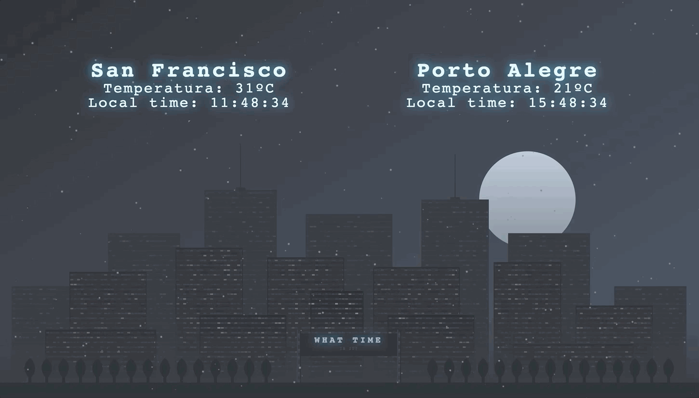

<h1 align="center">What time is it?</h1>

  

### ✨ [Demo](https://thaiane.github.io/what-time-is-it/)

## Author

👤 **Thai Braga**

* Website: thaiane.github.io
* Twitter: [@ThaiiBraga](https://twitter.com/ThaiiBraga)
* Github: [@Thaiane](https://github.com/Thaiane)
* LinkedIn: [@thaianefbraga](https://linkedin.com/in/thaianefbraga)

## Show your support

Give a ⭐️ if this project helped you!

***
_This README was generated with ❤️ by [readme-md-generator](https://github.com/kefranabg/readme-md-generator)_